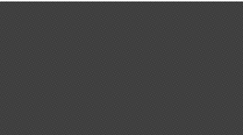

# Pandemic Simulation
A simple pandemic simulator written in C, based on https://github.com/cherrysrc/SpreadSimulator

Screenshot:
<p align="center">
  
</p>

## Simulation
The dots represent people: green are healthy, red are sick and orange are healed. They move around random on the screen from one point to another, if they arrive, another random destination and random speed are set up. When they are in contact, the sick dots have a chance to infect the healthy ones but not the already healed ones.

## Installation
```bash
make
./sim
```

## Requirements
- SDL2
- SDL2 mixer, image, and ttf

### Linux (Ubuntu)
```bash
sudo apt-get install libsdl2-dev
sudo apt-get install libsdl2-mixer-dev libsdl2-image-dev libsdl2-ttf-dev
```

### Linux (other)
Please refer to https://wiki.libsdl.org/Installation

### Windows10
Please refer to https://wiki.libsdl.org/Installation

### Windows10 WSL
Please refer to https://virtualizationreview.com/articles/2017/02/08/graphical-programs-on-windows-subsystem-on-linux.aspx

TLDR:
- Install [Xming](https://sourceforge.net/projects/xming/)
- Start the Ubuntu app
- `sudo apt-get install x11-apps`
- `export DISPLAY=:0`
- start sim by `./sim`

## Settings
Some of the variables set in `defs.h` control the simulation:
- NUM_DOTS: number of population
- INIT_INFECTED_PCTG: chance of being initially infected for every dot in percentage
- INFECTION_PCTG: chance of infection in percentage when two dots are in contact
- MIN_LENGTH: minimum length of being contagious in ticks
- VAR_LENGTH: additional random length of being contagious in ticks
Changing these values anr rerunning the simulation can bring different results.

## Todo
- Lots of refactoring as the codebase is a mess